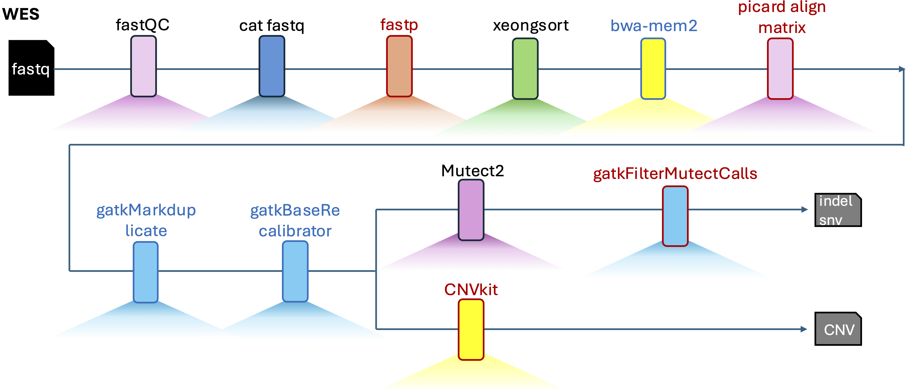

# WES Snakemake Workflow

**Version: 202509**

This workflow provides an end-to-end WES analysis pipeline for **PDX**, **PDO**, and **Patient Tissue** samples, customized for the **HPC4Health Slurm cluster**.  
It integrates widely used bioinformatics tools with cluster-optimized execution.

---
